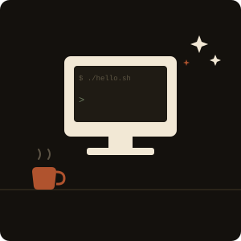

<table width="100%">
<tr>
<td width="38%" valign="top">

</td>
<td valign="middle">

```diff
+ Hi, I'm Pedro, an AI Engineer

@@ RAG, multi-agent systems, applied LLMs @@
+ São Luís, Brasil 🇧🇷 — CNPq fellow @ NCA/UFMA
+ Kotlin de dia, Python quando ninguém tá vendo
- prompt perfeito de primeira
```

👉 [linkedin.com/in/pedrof-ia](https://linkedin.com/in/pedrof-ia) 👈

<sub>[Lattes](http://lattes.cnpq.br/6595005053595072) · [Google Scholar](https://scholar.google.com.br/citations?user=9AXdPGUAAAAJ&hl=pt-BR&oi=sra) · [ORCID](https://orcid.org/0009-0009-2226-1125) · [last.fm](https://www.last.fm/user/pedayako)</sub>

</td>
</tr>
</table>
